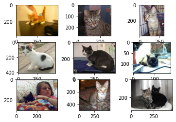

# Dogs vs Cats Image Classifier

* Using images provided from the “Dogs vs Cats” Kaggle challenge, develop an algorithm that can classify whether the given image is of a dog or cat. [(Kaggle challenge link)](https://www.kaggle.com/competitions/dogs-vs-cats/overview) 

## Overview

  * **Definition of the tasks / challenge:**  The task, as defined by the Kaggle challenge is to use the provided dataset of JPG images of dogs and cats, to write an algorithm that can attempt to output a prediction that correctly classifies the image as either a dog or cat.
  * **Your approach:** The approach for this image classification task is presented as a machine learning problem, using the deep convolution neural networks (CNNs) algorithm with JPG images as input to essentially be able to output a prediction through training. Furthermore, transfer learning will be applied by using a pre-trained model.
  * **Summary of the performance achieved:** Performance for the challenge is based on the percentage of correctly labeled images. At the time of writing, calculated with approximately 70% of the test data, the best/winner performance on Kaggle had a final score of 0.98914.

## Summary of Workdone

### Data

* Data:
  * Type:
    * Input: dog and cat images (varying sized pixel jpegs)
  * Size: 853.95 MB
  * Instances (Train, Test, Validation Split): 12,500 dogs, 12,500 cats for training, 25,000 for testing

#### Preprocessing / Clean up

* Describe any manipulations you performed to the data.
* The images from the dataset vary in sizes, thus is needed to be standardly resized, for example to 200 x 200 pixels.
* Proceeding with a high GPU with a minimum of 12 GB, (Google Colab Pro was used), we can load all the images, reshape them, and store it all in an array.

#### Data Visualization

Show a few visualization of the data and say a few words about what you see.
* Below are a few of the images of dogs and cats plotted. Notingly, the images are not of all the same size, hence the need for preprocessing.

### Problem Formulation

* Define:
  * Input / Output
  * Models
    * Describe the different models you tried and why.
  * Loss, Optimizer, other Hyperparameters.

### Training

* Describe the training:
  * How you trained: software and hardware.
  * How did training take.
  * Training curves (loss vs epoch for test/train).
  * How did you decide to stop training.
  * Any difficulties? How did you resolve them?

### Performance Comparison

* Clearly define the key performance metric(s).
* Show/compare results in one table.
* Show one (or few) visualization(s) of results, for example ROC curves.

### Conclusions

* State any conclusions you can infer from your work. Example: LSTM work better than GRU.

### Future Work

* What would be the next thing that you would try.
* What are some other studies that can be done starting from here.

## How to reproduce results

* In this section, provide instructions at least one of the following:
   * Reproduce your results fully, including training.
   * Apply this package to other data. For example, how to use the model you trained.
   * Use this package to perform their own study.
* Also describe what resources to use for this package, if appropirate. For example, point them to Collab and TPUs.

### Overview of files in repository

* Describe the directory structure, if any.
* List all relavent files and describe their role in the package.
* An example:
  * utils.py: various functions that are used in cleaning and visualizing data.
  * preprocess.ipynb: Takes input data in CSV and writes out data frame after cleanup.
  * visualization.ipynb: Creates various visualizations of the data.
  * models.py: Contains functions that build the various models.
  * training-model-1.ipynb: Trains the first model and saves model during training.
  * training-model-2.ipynb: Trains the second model and saves model during training.
  * training-model-3.ipynb: Trains the third model and saves model during training.
  * performance.ipynb: loads multiple trained models and compares results.
  * inference.ipynb: loads a trained model and applies it to test data to create kaggle submission.

* Note that all of these notebooks should contain enough text for someone to understand what is happening.

### Software Setup
* List all of the required packages.
* If not standard, provide or point to instruction for installing the packages.
* Describe how to install your package.

### Data

* Point to where they can download the data.
* Lead them through preprocessing steps, if necessary.

### Training

* Describe how to train the model

#### Performance Evaluation

* Describe how to run the performance evaluation.

## Citations

* Provide any references.

