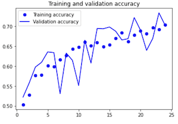
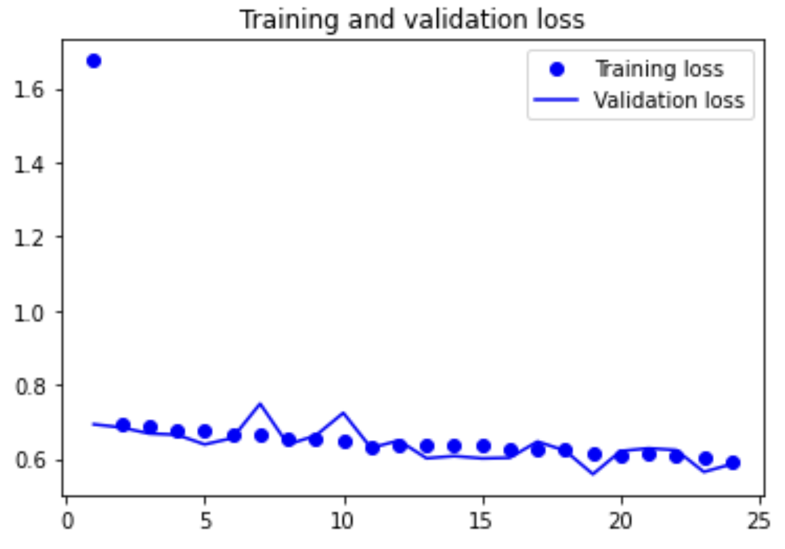

# Dogs vs Cats Image Classifier

* This repository contains implementations of three different models, a simple CNN, VGG16, and ResNet, for classifying images of dogs and cats from the Kaggle challenge 'Dogs vs Cats' dataset. The objective is to compare the performance of these models and determine which one achieves the highest accuracy. (Kaggle challenge link)

## Overview

  * **Definition of the tasks / challenge:**  The task, as defined by the Kaggle challenge is to use the provided dataset of dogs and cats images, to develop an algorithm to implment a model that will output an accurate prediction to classify the images.
  * **Your approach:** The approach used in this repository compares the performance of three different models (a simple CNN, VGG16, and ResNet) for classifying images of dogs and cats from the Kaggle challenge "Dogs vs Cats" dataset. The approach is to identify features in the images that distinguish between dogs and cats, and the models are trained and evaluated on a dataset of labeled images using transfer learning techniques to improve performance
  * **Summary of the performance achieved:** The performance of the model is measured in terms of classification accuracy, i.e., the percentage of test images that are correctly classified. At the time of writing, calculated with approximately 70% of the test data, the best/winner performance on Kaggle had a final score of 0.98914.

## Summary of Workdone

### Data

* Data:
  * Type: Image data
    * Input: 25,000 labeled images of dogs and cats
  * Size: ~853.95 MB
  * Instances: 25,000 training images, 12,500 testing images

#### Preprocessing / Clean up

* The images from the dataset vary in sizes and need to be resized; Images are resized to 150x150 pixels
* Images are rescaled to have pixel values between 0 and 1 (binary).
* Redirect files into standard directories and use Keras ImageGenerator class
* Randomly select 25% of images for use in test dataset

#### Data Visualization

* Below are a few of the images of dogs and cats plotted. Noting, the images are of different sizes.

### Problem Formulation

* Define:
  * Input: Images of dogs and cats of size 150x150 pixels (jpeg)
  * Output: Binary classification label (dog or cat)
  * Models: 
  1) Simple CNN
  * A convolutional neural network with two convolutional layers, each followed by a max-pooling layer, and two fully connected layers. The activation function used in the convolutional layers is ReLU, and the last layer uses the sigmoid activation function to produce a probability score for the binary classification.
    * Loss: Binary cross-entropy
    * Optimizer: Adam
    * Other Hyperparameters: Learning rate=0.0001, Dropout=0.5
    * Training: The model was trained for 20 epochs on a Google Colab using TensorFlow and Keras.

  2) VGG16
  * A convolutional neural network with two convolutional layers, each followed by a max-pooling layer, and two fully connected layers. The activation function used in the convolutional layers is ReLU, and the last layer uses the sigmoid activation function to produce a probability score for the binary classification.
    * Loss: Binary cross-entropy
    * Optimizer: Adam
    * Other Hyperparameters: Learning rate=0.0001, Dropout=0.5
    * Training: The model was trained for 20 epochs on a Google Colab using TensorFlow and Keras.

  3) ResNet
  * A convolutional neural network with two convolutional layers, each followed by a max-pooling layer, and two fully connected layers. The activation function used in the convolutional layers is ReLU, and the last layer uses the sigmoid activation function to produce a probability score for the binary classification.
    * Loss: Binary cross-entropy
    * Optimizer: Adam
    * Other Hyperparameters: Learning rate=0.0001, Dropout=0.5
    * Training: The model was trained for 20 epochs on a Google Colab using TensorFlow and Keras.

### Training

* Describe the training:
  * The training was done using TensorFlow and Keras libraries in Python programming language. The code was run on a Google Colab notebook with a GPU accelerator.
  * The training took 20 epochs, where each epoch represents one full pass through the training data.
  * The training loss decreased and the accuracy increased with each epoch. The validation loss and accuracy showed a similar trend. Overall, the training and validation loss decreased, while the training and validation accuracy increased with every epoch.
  * The training was stopped after 20 epochs. This was a pre-determined value, but early stopping techniques can be used to stop the training when the validation loss does not improve after a certain number of epochs.

### Performance Comparison

* The key performance metric used was accuracy.
* Results from CNN model:
  * The model achieved an accuracy of 83% on the testing set.
  
   
  

* Results from VGG16 model:
  * The model achieved an accuracy of _ on the testing set.

### Conclusions

* CNN Model
   * The model performed reasonably well on the testing set, with an accuracy of 83%.
   * The use of a simple convolutional neural network with two convolutional layers and two fully connected layers can be sufficient.
   * Overall, the CNN model seems to have achieved good accuracy on the validation dataset, but it has also been observed that the model is overfitting to the training dataset. This can be seen by comparing the training and validation accuracy values, where the difference between them increases as the number of epochs increases
 * VGG16 Model
   * The model performed ...

### Future Work

* Experiment with different network architectures and hyperparameters to improve the performance.
* Use transfer learning to fine-tune pre-trained models for this task.
* Apply this package to other image classification tasks.

## How to reproduce results

### Overview of files in repository

* The repository contains the following files:
   * DogCat_Project.ipynb: Main notebook containing all the code and experiments.
   * DogVisualization.png: Plotted test images of dogs.
   * CatVisualization.png: Plotted test images of cats.
   * Train_Valid_Accuracy.png: Training and validation accuracy plot
   * Train_Valid_Loss.png: Training and validation loss plot
   * README.md: Description of the project.

### Software Setup

* Required packages: TensorFlow, Keras, Matplotlib, NumPy
* To install the packages: pip install tensorflow keras matplotlib numpy
* Detailed instructions are provided in the README.md file.
* Usage of Google Colab for the GPU/TPU resources is recommended.

### Data

* The dataset can be downloaded from Kaggle (https://www.kaggle.com/c/dogs-vs-cats/data).
* Place the unzipped dataset in the project directory.
* The images should be placed in the 'train' and 'test' folders in the project directory.

### Training

* Run the notebook "DogCat_Project.ipynb" to train the model.
* To install the package containing the model and other necessary code, you can download the file and upload it to your environment or clone the GitHub repository. To clone the repository, run the following command in a terminal or in the Colab notebook:
 'git clone https://github.com/your_username/your_repository.git'
* To train the model, follow the main steps:
    1) Set the data directories for the training and testing data.
    2) Set the image size and batch size.
    3) Use the ImageDataGenerator class to rescale the pixel values of the images.
    4) Use the flow_from_directory method to generate batches of training and test data.
    5) Build the CNN model using the Sequential class and add layers to it.
    6) Compile the model using compile.
    7) Train the model using the fit method and the training data generator.

* Note: If you are running the code in Google Colab, you will need to mount your Google Drive to your notebook:
  'from google.colab import drive  
 drive.mount('/content/drive')'

#### Performance Evaluation

* Run the notebook "DogCat_Project.ipynb" to evaluate the model on the test set.
* Use visualization function plot_training_history() for further analysis and to plot results

## Citations

* Dataset: https://www.kaggle.com/c/dogs-vs-cats/data
* TensorFlow: https://www.tensorflow.org
* KerasProcessing: https://keras.io/api/preprocessing/image/

