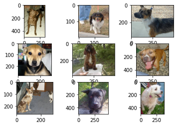

# Dogs vs Cats Image Classifier

* This repository holds a developed algorithm for the implementation of a Convolutional Neural Network (CNN) to classify images of dogs and cats from the Kaggle challenge "Dogs vs Cats" dataset with high accuracy.  [(Kaggle challenge link)](https://www.kaggle.com/competitions/dogs-vs-cats/overview)

## Overview

  * **Definition of the tasks / challenge:**  The task, as defined by the Kaggle challenge is to use the provided dataset of dogs and cats images, to develop an algorithm to implment a model that will output an accurate prediction to classify the images.
  * **Your approach:** The approach used in this repository is to build a CNN model that can identify features in the images that distinguish between dogs and cats. The model is trained on a dataset of labeled images of dogs and cats and is then evaluated on a separate test set. Furthermore, the use and implementation of transfer learning can improve the model performance.
  * **Summary of the performance achieved:** The performance of the model is measured in terms of classification accuracy, i.e., the percentage of test images that are correctly classified. At the time of writing, calculated with approximately 70% of the test data, the best/winner performance on Kaggle had a final score of 0.98914.

## Summary of Workdone

### Data

* Data:
  * Type: Image data
    * Input: 25,000 labeled images of dogs and cats
  * Size: ~853.95 MB
  * Instances: 25,000 training images, 12,500 testing images

#### Preprocessing / Clean up

* The images from the dataset vary in sizes and need to be resized; Images are resized to 150x150 pixels
* Images are rescaled to have pixel values between 0 and 1 (binary).
* Redirect files into standard directories and use Keras ImageGenerator class
* Randomly select 25% of images for use in test dataset

#### Data Visualization

* Below are a few of the images of dogs and cats plotted. Noting, the images are of different sizes.

### Problem Formulation

* Define:
  * Input: Images of dogs and cats (jpeg)
  * Output: Binary classification label (dog or cat)
  * Models: Experimenting with different CNN architectures

### Training

* Describe the training:
  * How you trained: software and hardware.
  * How did training take.
  * Training curves (loss vs epoch for test/train).
  * How did you decide to stop training.
  * Any difficulties? How did you resolve them?

### Performance Comparison

* Clearly define the key performance metric(s).
* Show/compare results in one table.
* Results from first CNN model:

 

### Conclusions

* State any conclusions you can infer from your work. Example: LSTM work better than GRU.

### Future Work

* What would be the next thing that you would try.
* What are some other studies that can be done starting from here.

## How to reproduce results

* In this section, provide instructions at least one of the following:
   * Reproduce your results fully, including training.
   * Apply this package to other data. For example, how to use the model you trained.
   * Use this package to perform their own study.
* Also describe what resources to use for this package, if appropirate. For example, point them to Collab and TPUs.

### Overview of files in repository

* Describe the directory structure, if any.
* List all relavent files and describe their role in the package.
* An example:
  * utils.py: various functions that are used in cleaning and visualizing data.
  * preprocess.ipynb: Takes input data in CSV and writes out data frame after cleanup.
  * visualization.ipynb: Creates various visualizations of the data.
  * models.py: Contains functions that build the various models.
  * training-model-1.ipynb: Trains the first model and saves model during training.
  * training-model-2.ipynb: Trains the second model and saves model during training.
  * training-model-3.ipynb: Trains the third model and saves model during training.
  * performance.ipynb: loads multiple trained models and compares results.
  * inference.ipynb: loads a trained model and applies it to test data to create kaggle submission.

* Note that all of these notebooks should contain enough text for someone to understand what is happening.

### Software Setup
* List all of the required packages.
* If not standard, provide or point to instruction for installing the packages.
* Describe how to install your package.

### Data

* Point to where they can download the data.
* Lead them through preprocessing steps, if necessary.

### Training

* Describe how to train the model

#### Performance Evaluation

* Describe how to run the performance evaluation.

## Citations

* Provide any references.

